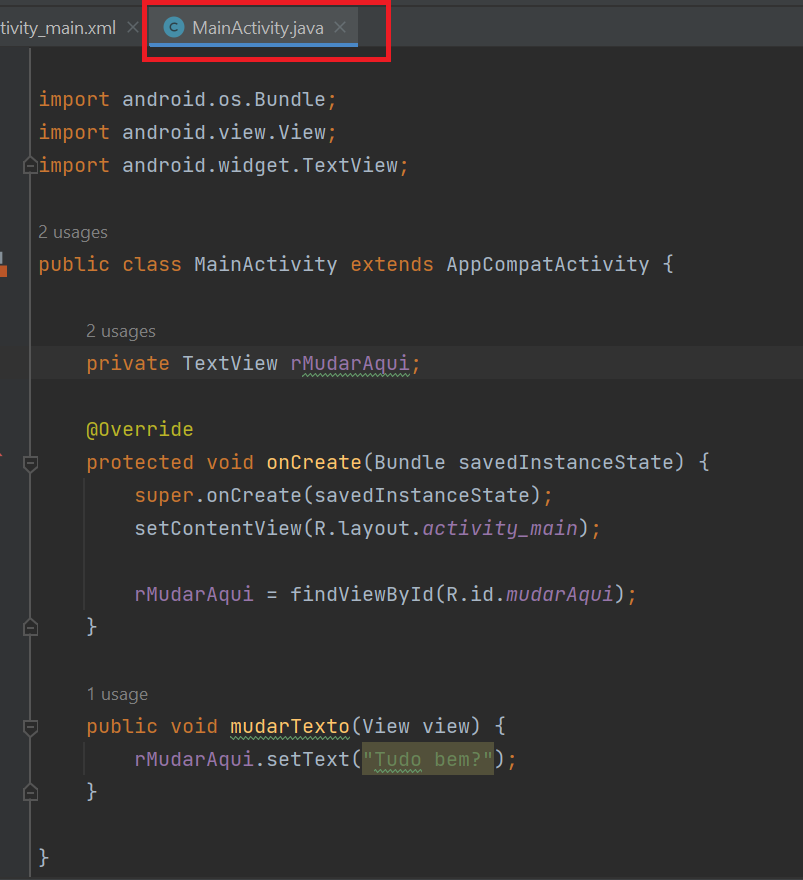

## Welcome! 👋

# Auto Complete with API

This is a code from my class teaching Android Studio for highschool studentes.

### Screen Shots
- ScreenShot
  
  
  
  

## Some code that I'm proud of
```java
public class MainActivity extends AppCompatActivity {

    private TextView rMudarAqui;

    @Override
    protected void onCreate(Bundle savedInstanceState) {
        super.onCreate(savedInstanceState);
        setContentView(R.layout.activity_main);

        rMudarAqui = findViewById(R.id.mudarAqui);
    }

    public void mudarTexto(View view) {
        rMudarAqui.setText("Tudo bem?");
    }

}
```

## Built with

- Android Studio;
- Java.

## Author

- Website - [My GitHub](https://github.com/lucasbailo)
- Frontend Mentor - [@lucasbailo](https://www.frontendmentor.io/profile/lucasbailo)
- Instagram - [@lucassbailo](https://www.instagram.com/lucassbailo/)
- LinkedIn - [Lucas Bailo](https://www.linkedin.com/in/lcsbailo)